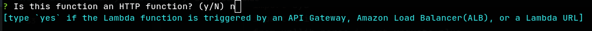
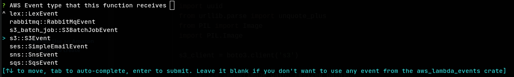
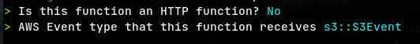
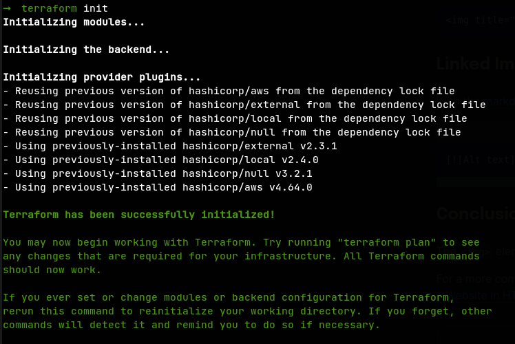
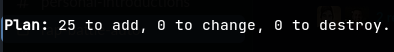
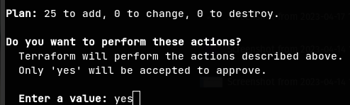
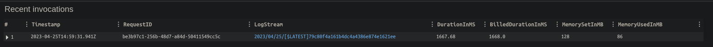
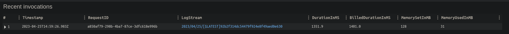

## Overview
I spend the past week an a half reading through the [Rust Book](https://doc.rust-lang.org/book/) and I'm going to try a little experiment, comparing the functionality of a Rust lambda to a Python lambda.

## The Experiment
I'm going to capture a pretty straightforward lambda function use case with S3, where a user will upload an image to a bucket, and a lambda function will run when the image is uploaded, make a smaller, thumbnail version of the image, and save it to a new location in the same bucket.

After enabling this functionality, I'm also going to maintain an index in DynamoDB, where we can store metadata about the image, including its thumbnail location.

Using 2 different languages for our Lambda functions, we can compare overall resource usage, which could extrapolate to potential cost savings if the Lambda executions span past the [AWS Free Tier](https://aws.amazon.com/free/?all-free-tier.sort-by=item.additionalFields.SortRank&all-free-tier.sort-order=asc&awsf.Free%20Tier%20Types=*all&awsf.Free%20Tier%20Categories=*all&all-free-tier.q=lambda&all-free-tier.q_operator=AND) allocation limits.

## Architecture
In order to build this workflow, we'll need to set up a few things:
- An S3 bucket to store our images
- An S3 event trigger to notify our lambda that a new image has been uploaded
- 2 Lambda functions (one in Python and one in Rust) to do the size conversion and store the relevant metadata
- A DynamoDB to store our metadata - We'll add this functionality later in Part 3


## Infrastructure
Let's get started on configuring our AWS resources. We're going to manage all of our resources in Terraform, which will make our infrastructure easy to create, update, and destroy.
Installation and instructions about how or why to use Terraform is outside the scope of this post. For more information, please refer to the [Terraform website](https://www.terraform.io/).

Let's start by creating an new project, and creating a folder for our Terraform code:
```shell
$ mkdir -p lambda_comparison/terraform
$ cd lambda_comparison/terraform
```

Before we start, it's always a good idea to configure Terraform and your providers. Create a new file called `terraform.tf` and add the following
___NOTE:___ Setting up default tags in the provider makes it easy to tag all your resources instead of passing a `local.tags` variable around to all your resources

##### __`terraform.tf`__
```hcl
terraform {
  required_providers {
    aws = {
      source  = "hashicorp/aws"
      version = "~> 4.64.0"
    }
  }
}

provider "aws" {
  region = "us-east-1"
  default_tags {
    tags = {
      Owner       = "banjackal"
      Provisioner = "Terraform"
      Project     = "Rust-Python Lambda Comparison"
    }
  }
}
```

Now, we need to define our resources. We're going to separate out our services into a few separate files just to keep our logical pieces together and to keep
individual files small. We'll start with our S3 resources in a file called `s3.tf`
___NOTE:___ Replace `<unique bucket name>` below with a name of your choosing

##### __`touch s3.tf`___
```hcl
resource "aws_s3_bucket" "images" {
  bucket = "<unique bucket name>"
}

resource "aws_s3_bucket_public_access_block" "block_public_access" {
  bucket = aws_s3_bucket.images.id

  block_public_acls       = true
  block_public_policy     = true
  ignore_public_acls      = true
  restrict_public_buckets = true
}
```

Next, we can add our lambda configurations.
Note that we're configuring the modules slightly differently for Python and Rust
Because Rust does not have a provider runtime, we are going to use the `provided.al2` runtime on arm64 architecture.
The [Rust Runtime for AWS Lambda](https://github.com/awslabs/aws-lambda-rust-runtime) will create a bootstrap.zip binary that we then use as our handler.

##### __`lambdas.tf`__
```hcl
data "aws_iam_policy_document" "lambda_policy" {
  statement {
    effect = "Allow"
    actions = [
      "s3:GetObject",
      "s3:ListBucket",
      "s3:PutObject",
    ]
    resources = [
      aws_s3_bucket.images.arn,
      "${aws_s3_bucket.images.arn}/*"
    ]
  }

  statement {
    effect = "Allow"
    actions = [
      "dynamodb:GetItem",
      "dynamodb:BatchGetItem",
      "dynamodb:Query",
      "dynamodb:PutItem",
      "dynamodb:UpdateItem",
      "dynamodb:DeleteItem",
      "dynamodb:BatchWriteItem"
    ]
    resources = [
      "arn:aws:dynamodb:::*"
    ]
  }
}

module "python_lambda_function" {
  source = "terraform-aws-modules/lambda/aws"

  publish = true

  function_name = "python_image_processor"
  description   = "Creates thumbnails of uploaded S3 images"
  handler       = "lambda_function.lambda_handler"
  runtime       = "python3.10"
  source_path   = "../python/"

  allowed_triggers = {
    S3Events = {
      principal  = "s3.amazonaws.com"
      source_arn = "arn:aws:s3:::*"
    }
  }

  attach_policy_json = true
  policy_json        = data.aws_iam_policy_document.lambda_policy.json

  memory_size = 128
  timeout     = 5
}

module "rust_lambda_function" {
  source = "terraform-aws-modules/lambda/aws"

  publish = true

  function_name          = "rust_image_processor"
  description            = "Creates thumbnails of uploaded S3 images"
  handler                = "bootstrap"
  runtime                = "provided.al2"
  architectures          = ["arm64"]
  create_package         = false
  local_existing_package = "../rust-image-processor/target/lambda/rust-image-processor/bootstrap.zip"

  allowed_triggers = {
    S3Events = {
      principal  = "s3.amazonaws.com"
      source_arn = "arn:aws:s3:::*"
    }
  }

  attach_policy_json = true
  policy_json        = data.aws_iam_policy_document.lambda_policy.json

  memory_size = 128
  timeout     = 5
}
```

### ___THIS NEXT STEP IS VERY IMPORTANT, PLEASE READ CAREFULLY___

We now need to set up our S3 triggers. We're going to create our trigger for each of our
lambda functions based on an S3 prefix.
It is important to specify the prefix so our Read, Transform, Upload workflow
does not continue triggering itself.
The durable autoscaling on Lambda means a mistake here could get expensive.
Additionally, when we later write the new files, we want to make sure we're uploading 
them to different prefixes.

##### __`s3_event_trigger.tf`__
```hcl
resource "aws_s3_bucket_notification" "bucket_notifications" {
  bucket = aws_s3_bucket.images.id

  lambda_function {
    lambda_function_arn = module.python_lambda_function.lambda_function_arn
    events              = ["s3:ObjectCreated:*"]
    filter_prefix       = "upload_for_python/"
  }

  lambda_function {
    lambda_function_arn = module.rust_lambda_function.lambda_function_arn
    events              = ["s3:ObjectCreated:*"]
    filter_prefix       = "upload_for_rust/"
  }
}
```

Lastly, we just need a simple DynamboDB table

##### __`dynamodb.tf`__
```hcl
module "dynamodb_table" {
  source = "terraform-aws-modules/dynamodb-table/aws"

  name     = "image_metadata"
  hash_key = "id"

  attributes = [
    {
      name = "id"
      type = "N"
    }
  ]
}
```

## Python Code
For starters, we're just going to worry about reading from S3, resizing the image,
then writing it to S3. Convenietly enough, AWS provides great documentation, including example code in a [tutorial](https://docs.aws.amazon.com/lambda/latest/dg/with-s3-tutorial.html) that we can borrow from.
___NOTE:___ The example from the tutorial has been modified to upload the resized image to a different prefix in the _same_ S3 bucket instead of a different bucket

Before we start, let's hop out of our `terraform` directory and make a new folder at the project root called `python`
```shell
$ cd ..
$ mkdir python/
$ cd python/
```

Now, add the lambda function and the requirements.txt

##### __`lambda_function.py`__
```python
import boto3
import os
import sys
import uuid
from urllib.parse import unquote_plus
from PIL import Image
import PIL.Image
            
s3_client = boto3.client('s3')
            
def resize_image(image_path, resized_path):
  with Image.open(image_path) as image:
    image.thumbnail(tuple(x / 2 for x in image.size))
    image.save(resized_path)
            
def lambda_handler(event, context):
  for record in event['Records']:
    bucket = record['s3']['bucket']['name']
    key = unquote_plus(record['s3']['object']['key'])
    print(f'resizing {key}')
    tmpkey = key.replace('/', '')
    print(f'tmpkey {key}')
    download_path = '/tmp/{}{}'.format(uuid.uuid4(), tmpkey)
    upload_path = '/tmp/resized-{}'.format(tmpkey)
    s3_client.download_file(bucket, key, download_path)
    resize_image(download_path, upload_path)

    upload_key = 'resized-python/{}'.format('/'.join(key.split('/')[1:]))
    print(f'uploading to {upload_key}')
    s3_client.upload_file(upload_path, '{}'.format(bucket), upload_key)
```

##### __`requirements.txt`__
```
Pillow == 9.5.0
```

## Rust Code
Now, assuming we already have Rust and Cargo installed, we need to add the AWS Rust Lambda Runtime
Install [cargo-lambda](https://www.cargo-lambda.info/guide/installation.html)
Using [Rust Lambda Runtime](https://github.com/awslabs/aws-lambda-rust-runtime)

Again, let's hop out of our last directory and use `cargo lambda` to create our new project folder
```shell
$ cd ..
$ cargo lambda new rust-image-processor
```

Running `cargo lambda new` will then give you some prompts:
- For the first prompt, select `N`

- For the second prompt, scroll down until you find `S3Event`

- The result should look like this


Now, let's jump into our Rust project update our Lambda function code
```shell
$ cd rust-image-processor
```
##### __`src/main.rs`__
```rust
use aws_lambda_events::event::s3::S3Event;
use aws_lambda_events::s3::S3EventRecord;
use lambda_runtime::{run, service_fn, Error, LambdaEvent};
use image::ImageError;
use s3::bucket::Bucket;
use s3::creds::Credentials;
use std::io::Cursor;

/// This is the main body for the function.
/// Write your code inside it.
/// There are some code example in the following URLs:
/// - https://github.com/awslabs/aws-lambda-rust-runtime/tree/main/examples
/// - https://github.com/aws-samples/serverless-rust-demo/
async fn function_handler(event: LambdaEvent<S3Event>) -> Result<(), Error> {
    // Extract some useful information from the request
    for record in event.payload.records {
        let _ = process_record(record).await;
    }
    Ok(())
}

async fn process_record(record: S3EventRecord) -> Result<(), Error> {
        //extract fields from event record
        let bucket_name = record.s3.bucket.name.unwrap();
        //string is urlencoded, need to convert
        let object_key = record.s3.object.key.unwrap();
        let object_key = urlencoding::decode(&object_key).expect("UTF-8");

        let region = record.aws_region.unwrap().parse()?;

        //initialize bucket
        let credentials = Credentials::default()?;
        let bucket = Bucket::new(&bucket_name, region, credentials).expect("Unable to connect to bucket");
        
        //Get object
        let object = bucket.get_object(&object_key).await?;
        // let object = image::load_from_memory(object.bytes()).unwrap();
        let reader = image::io::Reader::new(Cursor::new(object.bytes())).with_guessed_format()?;

        //gets the source format so we can use it in our write
        let object_format = reader.format().unwrap();
        let object = reader.decode()?;

        //Scale image
		let scale_ratio = 0.5;
        let resized = resize_image(&object, &scale_ratio).unwrap();

        // Create new S3 key name from source without the prefix
        let removed_root_folder = get_route_without_root(&object_key);
        let target = format!("resized-rust{}", removed_root_folder);
		println!("Uploading resized image to {}", target);

        //write to bytes
        let mut bytes: Vec<u8> = Vec::new();
		resized.write_to(&mut Cursor::new(&mut bytes), image::ImageOutputFormat::from(object_format))?;

        // Upload new image to s3
        let _uploaded = bucket.put_object(&target, &bytes).await?;
        println!("Uploaded resized image");

        Ok(())

}

 fn get_route_without_root(path: &str) -> &str {
 	let bytes = path.as_bytes();
 	for (i, &item) in bytes.iter().enumerate() {
 		if item == b'/' {
 			return &path[i..];
 		}
 	}
 	&path
 }

fn resize_image(img: &image::DynamicImage, ratio: &f32) -> Result<image::DynamicImage, ImageError> {
    let old_w = img.width() as f32;
    let old_h = img.height() as f32;
    let new_w = (old_w * ratio).floor();
    let new_h = (old_h * ratio).floor();

    let scaled = img.resize(new_w as u32, new_h as u32, image::imageops::FilterType::Lanczos3);

    Ok(scaled)
}

#[tokio::main]
async fn main() -> Result<(), Error> {
    tracing_subscriber::fmt()
        .with_max_level(tracing::Level::INFO)
        // disable printing the name of the module in every log line.
        .with_target(false)
        // disabling time is handy because CloudWatch will add the ingestion time.
        .without_time()
        .init();

    run(service_fn(function_handler)).await
}
```

Now, we build our lambda package with `cargo lambda build`

```shell
$ cargo lambda build --release --arm64 --output-format zip
```

You can see the output `bootstrap.zip` was created at `target/lambda/rust-image-processor/`


## Time to Deploy
Now, let's go back into our `terraform` directory, and run our `terraform init` and `terraform plan`
```shell
$ cd ../terraform
$ terraform init
```


`terraform plan` should want to create 25 resources
```shell
$ terraform plan
```


Now, run a `terraform apply` and select 'yes' when prompted
```shell
$ terraform apply
```



## Testing
Now, we can use the AWS CLI to upload images to our bucket and validate the output. For my testing, I'm just using a simple screenshot PNG image

```shell
$ aws s3 cp 'test-screenshot.png' s3://<bucket name>/upload_for_rust/
$ aws s3 cp 'test-screenshot.png' s3://<bucket name>/upload_for_python/
```

Then we can check the output
```shell
$ aws s3 ls s3://<bucket name>/resized-rust/
2023-04-25 10:59:27      61322 test-screenshot.png

$ aws s3 ls s3://<bucket name>/resized-python/
2023-04-25 10:59:32      45821 test-screenshot.png
```

Great, our lambda functions worked as expected.

## Metrics
Using the AWS Console, I want to see how these lambdas performed in this one instance, so I'll check the Logs in the Monitoring section of the Lambda console:

#### Python Lambda

#### Rust Lambda


The Rust cold start is sligthtly faster and uses significantly less memory. Let's explore
how much the performance gap expands later after we add DynamoDB integration and send more requests to the functions.

## Cleanup
If you've been following along, feel free to empty the S3 bucket and tear down your Terraform stack
```shell
$ aws s3 rm s3://<bucket name>/ --recursive
$ terraform destroy
```

