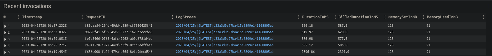
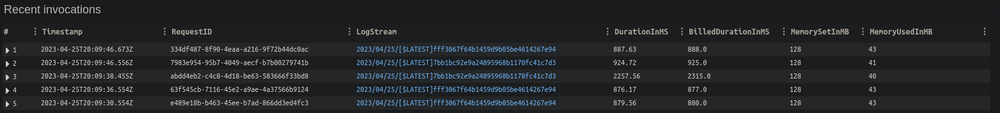

## Overview
Now that we have working lambdas to resize images in S3, let's add functionality to maintain an index of the full-size and thumbnail versions of each image in DynamoDB.
This way, when we run our functions, we'll have an index in DynamoDB that will tell us where the corresponding thumbnail is located

In [Part 2](/rust_lambda_pt2) we already configured our DynamoDB table, so now all we need to do is write some code!

## Python Lambda
We're going to update our function from Part 2
##### __`python/lambda_function.py`__
```python

# --snipped imports--

s3_client = boto3.client('s3')
dynamodb = boto3.resource('dynamodb')
table = dynamodb.Table('image_metadata')

# --sniped def resize_image-

def lambda_handler(event, context):

# --snipped previous code--

    table.put_item(Item={
        'id': key,
        'fullsize-path': key,
        'thumbnail-path': upload_key,
        })
```

## Rust Lambda
##### __`rust-image-processor/main.rs`__
```rust
// --snipped previous 'use' imports--

use aws_config::meta::region::RegionProviderChain;
use aws_sdk_dynamodb as dynamodb;

// --snipped previous code--

async fn process_record(record: S3EventRecord) -> Result<(), Error> {

// --snipped previous code--

        put_on_dynamo(&object_key, &target).await?;

        Ok(())
}

async fn put_on_dynamo(original_path: &str, thumbnail_path: &str) -> Result<(), Error> {
	let region_provider = RegionProviderChain::default_provider().or_else("us-east-1");
	let config = aws_config::from_env().region(region_provider).load().await;
	let client = dynamodb::Client::new(&config);

	let request = client
		.put_item()
        .table_name("image_metadata")
        .item("id", dynamodb::types::AttributeValue::S(String::from(original_path)))
        .item("fullsize-path", dynamodb::types::AttributeValue::S(String::from(original_path)))
        .item("thumbnail-path", dynamodb::types::AttributeValue::S(String::from(thumbnail_path)));

    let response = request.send().await?;

    println!("Wrote item {:?}", response);

    Ok(())
}
```

Don't forget to recompile your Rust lambda!

```shell
$ cd rust-image-processor
$ cargo lambda build --release --arm64 --output-format zip
```

## Testing again
Now, go back to the `terraform` directory and let's `terraform apply` again, this will update our Lambda functions. We then can copy test images to our S3 bucket again and now check that we have entries in our DynamoDB table
```shell
$ aws dynamodb scan --table-name image_metadata

{
    "Items": [
        {
            "fullsize-path": {
                "S": "upload_for_rust/test-screenshot.png"
            },
            "thumbnail-path": {
                "S": "resized-rust/test-screenshot.png"
            },
            "id": {
                "S": "upload_for_rust/test-screenshot.png"
            }
        },
        {
            "fullsize-path": {
                "S": "upload_for_python/test-screenshot.png"
            },
            "thumbnail-path": {
                "S": "resized-python/test-screenshot.png"
            },
            "id": {
                "S": "upload_for_python/test-screenshot.png"
            }
        }
    ],
    "Count": 2,
    "ScannedCount": 2,
    "ConsumedCapacity": null
}
```

## Analysis
Now, let's try running our lambda functions a few times and check out our CloudWatch
metrics. For my first test, I'm uploading the same screenshot 5 times to each bucket
prefix.

#### Python

#### Rust


Well, this is interesting. The Python lambda is actually running faster than our Rust lambda. However, the Rust lambda is using considerably less memory, only aboud 1/3 of the 128MB we allocated, where the Python lambda is running almost half the total allocated memory

Let's try uploading a larger screenshot to see what happens. I'm going to use a whole-screen screenshot, which should be a little bigger.

#### Python

| DurationInMS | BilledDurationInMS | MemorySetInMB | MemoryUsedInMB |
| ---- | ---- | ---- | ---- |
| 4543.07 | 4544.0 | 128 | 113 |

#### Rust

| DurationInMS | BilledDurationInMS | MemorySetInMB | MemoryUsedInMB |
| ---- | ---- | ---- | ---- |
| 4242.12 | 4296.0 | 128 | 60 |

Now we're getting somewhere! Let's try again with a much larger image, a 2.1MB cat


This one actually caused the Rust lambda to timeout (at 5 seconds) and the Python lambda ran in about 4.5. I'm starting to think that perhaps the Rust image processing isn't as efficient as it could be. I'll investigate and see if I can't identify some efficiency improvements in a future part.

