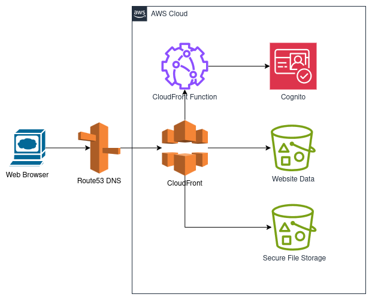
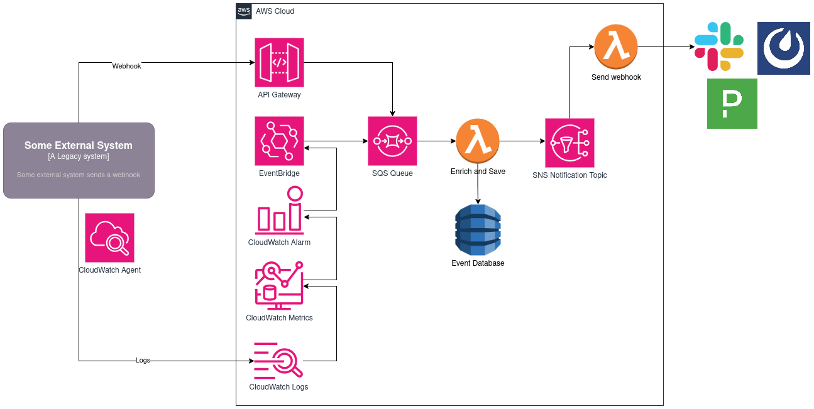
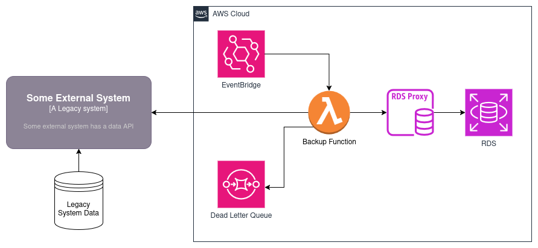

# Overview

AWS offers _hundreds_ of individual services that you can use to build resilient, perfomant, modern cloud applications. With all of those services, it can be overwhelming to know exactly where to look or which services to use. In my time as a developer and DevOps professional, I've encountered a few different application architecture patterns that have solved some fairly common problems.

Please note, I am purposely obfuscating the network layer for the sake of simplicity and focusing on application components. Without knowing your networking architecture, it can be difficult to prescribe specific networking patterns, because they may not apply to your individual situation.

# Core services

When it comes to the expansive catalog of AWS services, there's a few that are very commonly used for most of the systems I've worked with. Organized by category, those are:

## Compute

- Lambda
- Elastic Compute Service (ECS)
- EC2

## Storage

- Elastic Block Storage (EBS)
- Elastic File System (EFS)
- Simple Storage Service (S3)

# Security, identity, and compliance

- Cognito
- Secrets Manager
- Identity and Access Management (IAM)
- Key Management Service (KMS)
- AWS Certificate Manager (ACM)

## Database

- DynamoDB
- Relational Database Service (RDS)

## Application integration

- Simple Queue Service
- Simple Notification Service
- EventBridge
- Step Functions

## Networking and content delivery

- API Gateway
- Route 53
- VPC
- CloudFront
- Elastic Load Balancing

## Management and governance

- Auto Scaling
- CloudWatch
- Systems Manager (SSM)

Now, while this still seems like a lot of services, this is still a significanlly smaller list than the extensive [AWS service catalog](https://docs.aws.amazon.com/whitepapers/latest/aws-overview/amazon-web-services-cloud-platform.html)

It will be helpful to familiarize yourself with these services first, so that you have a better understanding of how these patterns work.

# Patterns

Each of the following pattern can be used, along with some savvy coding, to solve particular business problems. I'll give an example of each problem and why the application pattern is used to solve it efficiently.

These patterns represent business problems I've successfully adapted at numerous internal shops and client systems to solve real business problems.

For the sake of the descripitons, I'm going to be referring to your business partners, clients, customers, etc. only as "customers".

## Problem: I need to securely share a confidential file with someone else

"Yes, we have an encrypted email feature, but we aren't actually allowed to use it to send confidental documents" is a phrase I've heard at more than a few shops. AWS S3 makes it easy to save and securely access data, including full end-to-end encryption of the files. Often times, the customers that want to actually use this tool to share documents aren't other engineers, so we need to provide then a lightweight, secure way of transferring files and ensuring only the intended recipient is viewing them.

The following design makes use of using CloudFront + S3 to serve a static site, and the S3 presigned URLs

A custom static site is written and stored in an S3 bucket, which is served via CloudFront.

First, users authenticate with Cognito, using a CloudFront function. Then, they use a static site to submit one or more attachments. Upon submitting, the files are stored, encrypted at rest, and only rretrievable via presigned URL, which is returned to the uploading user. The user then can give the URL (which has an expiration date) to whomever they want to share the file with, and all they need to do is open the file via the link.

This design can be iterated on to be a one-stop system, where users can upload files and pick from an users existing Cognito user pool to share their files with. This introduces some coding complexity, but makes for a more secure feeling system to the end users.

## Problem: I need to be notified when \<some event\> happens

Often times, customers want to be notified when a particular event occurs, either within your system or as part of a system integration. Solving this challenge takes a few things into consideration:

1. The customer has one or more preferred notification channels or systems -- either of which do not have a simple integration point for the source of the notification
1. Customers want to track and see a historical record of when certain events occurred
1. There is a business need to enhance the original alert data with additional internal system data

These considerations definitely make the problem more interesting -- we have to worry about additional integration points (pronounced "points-of-failure") and potentially sprawling business logic trees, as well as maintaining an ever-growing database, most of which won't be referenced after a month or two, save the year-end report.

___This design is making a few assumptions:___

1. The legacy system is able to send webhooks
1. We have enough control over the system that we can install the AWS Cloudwatch Agent
1. We have a firewall hole, DirectConnect connection, or Site-to-site VPN that allows us to communicate with the AWS Cloud from our Data Center

Now, with this design we have 2 possible channels to send data into our notification system:

1. Internal system events can send notifications to our processing engine with a webhook. This webhook enters via API Gateway, which proxies the event to an SQS Queue
1. We can export logs to CloudWatch Logs using the CloudWatch Agent. From there, we configure custom CloudWatch Metrics. These custom metrics crawl the log streams and create data points based on log filters. We can use these to count the frequency of different log levels in a set amount of time, or even filter for specific keywords, based on our knowledge of the logging conventions. Once we have these metrics configured, we can set metric thresholds via CloudWatch Alarms, which push status changes to EventBridge. We configure an EventBridge rule to put this alarm message on our SQS queue.

The SQS Queue holds messages that need to be processed into alerts. I prefer holding these messages here instead of trying to process them all immediately as they happen. The main benefit, is that I get visibility into failures in message processing. The intent of this system is to serve as an intermediary between alert sources and alert receivers. In order to ensure that triggered alerts are getting to their destinations, we want to have a robust system that can retry messages and hold onto "poison pill" messages that may keep failing, so that we can incrementally improve the performance of our custom code.

Now, the part that will be specific to your business needs is the Lambda function which will enrich and save the event data. Often times, the event itself has a lot of information, but in an enterprise environment with a microservices architecture, often additional useful metadata is necessary -- we may need additional context to determine which channel needs to be alerted, for example. In short, you want to use a compute service like Lambda to gather that additional metadata before saving off your enriched alert in a database. Keeping a log of all the alerts coming in is useful for ops teams to monitor our own system, and we can use it to gather metrics for reports of system health.

Once the event has been enriched with our business data, we publish to an SNS topic. Now, we _could_ just send our alert off to our notification channel (Slack, Mattermost, PagerDuty, etc.), but oftentimes other systems may want to know when these events are occurring as well, so publishing to an SNS topic allows other systems to subscribe to these notifications. For example, we could build an additional system that listens to all of our notifications and looks for database errors, which could trigger an automated failover of the source system database, further automating the alert actions.

We subscribe our own lambda function to this SNS topic, and this function has the sole responsibility of notifying our notification channels. There may be custom business logic here to deterimine where it needs to go, based on the metadata we gathered previously. Since we stored the alert data in our DynamoDB table, we can retrieve the full notification data from our database, and only pass information to the SNS topic that is necessary for subscription systems to handle any additional notification automations.

## Problem: I want to automatically back up my legacy system data

AWS storage and database services have some great built-in automation for saving and restoring backups and snapshots. When dealing with legacy, often on-premises systems, however, there is often a need to export the system data to store it externally. This data transfer system needs to be secure and the data needs to be stored, uncorrupted, for a defined period of time, often 30 days in "hot" storage (easily and quickly retrievable) and up to a year or more in "cold" storage (stored inexpensively, retrievable at a often higher cost). The transfer of data out of the system usually needs to happen on a nightly schedule.

This design makes two assumptions: 
1. There exists a mechanism that we can use to pull all the system data from our external system (API endpoint, direct DB query on a read node, etc.)
1. The data backup needs to be a "hot" backup: another team is working on a system which will enable the legacy system to read from our backup database immediately in the event of an outage

We use EventBridge in this design to create a Cron schedule: we'll start this process every so often, based on our cron definition (nightly, only on weekends, every minute, on the 20th of the month, etc.). On this interval, we trigger a lambda function that will retrieve the data from our system, and store it in an RDS database. Depending on your backup use case, you may want to only query from the last time a backup was done, or you may have multiple functions on multiple schedules to perform incremental backups vs full backups. The decision really depends on your use case.

Additionally, if you have very complex or long-running tasks needed to backup large amounts of data, you can replace the single Labmda function with a Step Function workflow. Using a Step Function, you can split up the work into more shorter running tasks, even in parallel.

In the event you want to use cold storage of your databases, this design can be modified to use S3 instead of RDS. If your legacy data system has built-in backup functionality, use your lambda to trigger a backup on your legacy system, and then copy that backup to your S3 storage. This will dramatically reduce processing time and storage costs.

# Conclusion

These are a few common patterns that I've used in numerous solutions to accomplish recurring problems in some enterprise systems. By writing some robust business logic in your code, you too can solve some of these common problems by using and adapting these patterns above. In some cases, you may have a better use of a different compute, database, or storage service, based on your individual business needs. The services used here are not a prescriptive guide into which services to use, they are here to act as a guide or a starting point in your systems design journey. Any decision has tradeoffs, and it's up to you to manage those in your design, and not be afraid to pivot as you gain more knowledge of how your system needs to behave.